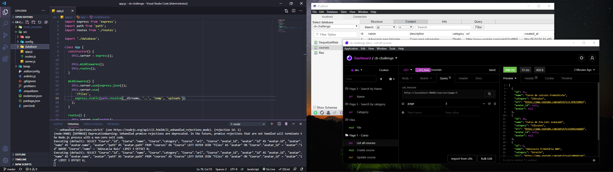
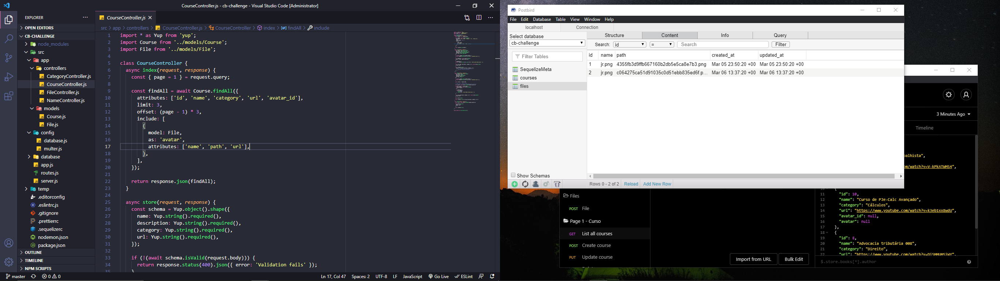
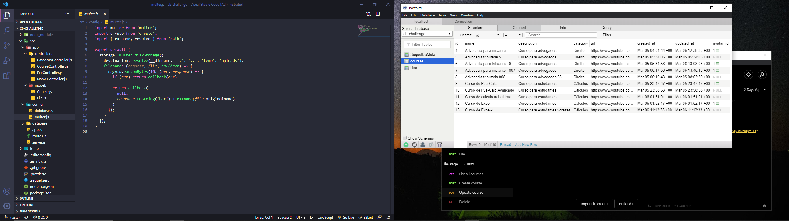

<h1 align="center" style="    max-width: 250px;
    margin: 30px 0;">
    <br>
    Curso Beta &nbsp; &#128218
</h1>


<h4 align="center">
  An API that helps you navigate the largest school of judicial experts - (https://www.cursobeta.com.br/)
</h4>

<p align="center">
  <a href="#rocket-technologies">Technologies</a>&nbsp;&nbsp;&nbsp;|&nbsp;&nbsp;&nbsp;
  <a href="#information_source-how-to-use">How To Use</a>&nbsp;&nbsp;&nbsp;|&nbsp;&nbsp;&nbsp;
  <a href="#sunny-result">Result</a>
</p>


## :rocket: Technologies

This project was developed with the following technologies:

- [NodeJs](https://nodejs.org/en/)
- [Docker](https://hub.docker.com/_/postgres)
- [Postbird](https://www.electronjs.org/apps/postbird)
- [Insominia](https://insomnia.rest/download)
- [Yup](https://reactjs.org/)
- [Multer](https://www.npmjs.com/package/multer)
- [Sequelie](https://sequelize.org/master/manual/getting-started.html)
- [Prettier](https://prettier.io/)
- [VS Code][vc] with [EditorConfig][vceditconfig] and [ESLint][vceslint]


## :information_source: How To Use


To clone and run this application, you'll need [Git](https://git-scm.com), [Node.js v12.18.4][nodejs] or higher + [Yarn v1.22][yarn] or higher installed on your computer. From your command line:


```bash
# Clone this repository
$ git clone https://github.com/Ivo-Jr/cb-challenge.git

# Go into the repository
$ cd cd-challenge

# Install dependencies 
$ yarn or npm install

# Run the app
$ yarn or npm start
```


#### To monitor the handling of requests and responses, Install:
- [Insomina](https://insomnia.rest/download)

#### To containerize the application install
- [Docker](https://docs.docker.com/docker-hub/)
```bash
# To run the Postgres database, run inside the Docker
$ docker run --name database -e POSTGRES_PASSWORD=docker -p 5433:5432 -d postgres
```
#### To view the data in the database, install
- [Postbird](https://www.electronjs.org/apps/postbird)


```

## :file_folder: Folder structure

```bash

.


├── src >> source code
│   ├── app
│   │   ├── controllers
│   │   │   └── CategoryController.js
│   │   │   └── CourseController.js
│   │   │   └── FileController.js
│   │   │   └── NameController.js
│   │   │
│   │   ├── Models
│   │   │   └── Course.js
│   │   │   └── File.js
│   │   │
│   │   ├── config
│   │   │   └── database.js
│   │   │   └── multer.js
│   │   │   
│   │   └── database
│   │       ├── migrationss
│   │       │   └── 20210305012236-create-course.js
│   │       │   └── 20210305171106-create-files.js
│   │       │   └── 20210305181403-add-avatar-field-to-courses.js
│   │       └── index.js
│   │
│   └── app.js
│   └── routes.js
│   └──server.js
│
│
├── temp
│   └── uploads
│   
├── .editorconfig
├── .eslintrc.js
├── .gitignore.js
├── .prettierrc.js
├── .sequelizerc.js
├── nodemon.json
├── package.json
├── README.md
└── yarn.lock

```

## :sunny: Result

  <div style="display: flex;   flex-direction: column;
  align-items: center;">
  <h1 align="center" style="display: flex; flex-direction:row;">
      
        <br/>
        <br/>
        <br/>
      
        <br/>
        <br/>
        <br/>
      
  </h1>
  </div>


---

Made with ♥ by Ivo Junior :wave: [Get in touch!](https://www.linkedin.com/in/jos%C3%A9-ivo-maciel-j%C3%BAnior-658136145/)

[nodejs]: https://nodejs.org/
[yarn]: https://yarnpkg.com/
[vc]: https://code.visualstudio.com/
[vceditconfig]: https://marketplace.visualstudio.com/items?itemName=EditorConfig.EditorConfig
[vceslint]: https://marketplace.visualstudio.com/items?itemName=dbaeumer.vscode-eslint
